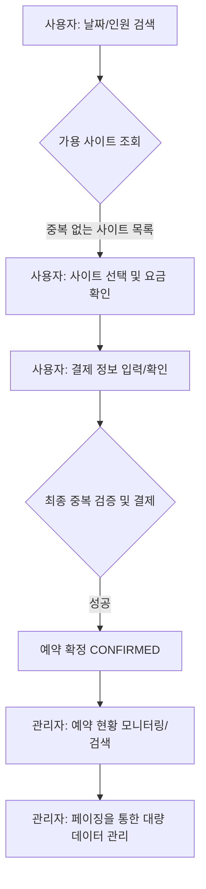

# Reservation 도메인 최종 통합 리포트 (Phase 2 완료)

**날짜**: 2026-03-17  
**작성자**: parkcoding (Git user.name)  
**작업 단계**: Phase 2 MVP 핵심 도메인 (Reservation) 기능 구현 및 페이징 고도화 완료

---

## 🗺️ 1. 전체 흐름 (Flow) 시각화

예약 도메인은 사용자의 검색부터 관리자의 최종 확인까지 유기적으로 연결되어 있습니다. 아래 흐름도는 데이터가 어떻게 흐르고 상태가 변하는지를 보여줍니다.



### [단계별 상세 설명]

| 단계        | 주요 행위                              | 시스템 내부 동작                                                       |
| :---------- | :------------------------------------- | :--------------------------------------------------------------------- |
| **1. 검색** | 사용자가 원하는 일정(체크인/아웃) 입력 | DB에서 해당 날짜와 겹치는 기존 예약이 없는 사이트만 필터링             |
| **2. 선택** | 배치도 또는 목록에서 사이트 선택       | 클라이언트 JavaScript가 인원수/박수에 따른 요금을 실시간 계산          |
| **3. 검증** | 사용자가 '예약하기' 클릭               | 서버가 다시 한번 가격을 계산하고, 그 찰나의 중복 예약 여부를 최종 확인 |
| **4. 완료** | 예약 성공 페이지 이동                  | **PRG 패턴**을 사용하여 새로고침 시 중복 예약 방지                     |
| **5. 관리** | 관리자가 전체 내역 조회                | **Paging 기술**을 적용하여 수천 건의 데이터도 빠르고 끊김 없이 조회    |

---

## 💻 2. 핵심 코드 분석 (실행 순서별 전체 메서드 구현)

사용자가 캠핑장을 예약하고 관리자가 이를 확인하는 전체 과정을 소스 코드 레벨에서 상세히 살펴봅니다.

### Step 1. 가용 사이트 검색 및 중복 체크 (Task 1)

사용자가 날짜와 인원을 입력하면, 시스템은 해당 기간에 이미 예약된 사이트를 제외하고 검색합니다.

```java
// ReservationRepository.java - [Task 1-2] 중복 예약 제외 가용 사이트 조회 JPQL
@Query("SELECT s FROM Site s JOIN FETCH s.zone z WHERE " +
        "(:zoneId IS NULL OR z.id = :zoneId) AND " +
        "(:peopleCount IS NULL OR s.maxPeople >= :peopleCount) AND " +
        "s.id NOT IN (" +
        "  SELECT r.site.id FROM Reservation r " +
        "  WHERE (r.checkIn < :checkOut AND r.checkOut > :checkIn) " + // 💡 기간 중복 공식: 내 시작 < 남의 종료 AND 내 종료 > 남의 시작
        "  AND r.status IN :statuses" + // PENDING, CONFIRMED 등 활성화된 예약만 대상
        ")")
List<Site> findAvailableSites(@Param("checkIn") LocalDate checkIn,
                              @Param("checkOut") LocalDate checkOut,
                              @Param("statuses") List<ReservationStatus> statuses,
                              @Param("zoneId") Long zoneId,
                              @Param("peopleCount") Integer peopleCount);

// ReservationService.java - [Task 1-2] 검색 조건에 따른 가용 사이트 목록 반환
public List<SiteResponse.ResevationAvailableListDTO> findAvailableSites(ReservationRequest.SearchDTO searchDTO) {
    LocalDate checkIn = searchDTO.getCheckIn();
    LocalDate checkOut = searchDTO.getCheckOut();

    // 1. 체크 대상 예약 상태 정의 (신청 중, 확정, 취소 요청 중인 건들)
    List<ReservationStatus> activeStatuses = List.of(ReservationStatus.PENDING, ReservationStatus.CONFIRMED,
                    ReservationStatus.CANCEL_REQ);

    // 2. Repository를 통해 중복되지 않은 사이트 목록 조회
    List<Site> availableSites = reservationRepository.findAvailableSites(
                    checkIn, checkOut, activeStatuses, searchDTO.getZoneId(), searchDTO.getPeopleCount());

    // 3. Entity를 화면용 DTO로 변환하여 반환
    return availableSites.stream()
                    .map(site -> new SiteResponse.ResevationAvailableListDTO(site))
                    .toList();
}
```

### Step 2. 사이트 선택 및 실시간 가격 계산 (Task 1, 4)

배치도에서 구역을 필터링하고 사이트를 선택하면 JavaScript가 실시간으로 최종 요금을 계산합니다.

```javascript
/* reservation/new.mustache - [Task 4-2] 구역(Zone) 필터링 */
function filterByZone(zoneName, element) {
  const cards = document.querySelectorAll(".site-card");
  const pins = document.querySelectorAll(".zone-pin");

  // 1. 이미 선택된 구역을 다시 클릭하면 필터 해제 (토글)
  if (currentFilterZone === zoneName) {
    currentFilterZone = null;
    pins.forEach((p) => p.classList.remove("active"));
    cards.forEach((c) => c.classList.remove("d-none"));
  } else {
    // 2. 새로운 구역 선택 시 핀 스타일 업데이트 및 카드 필터링
    currentFilterZone = zoneName;
    pins.forEach((p) => p.classList.remove("active"));
    element.classList.add("active");

    cards.forEach((card) => {
      if (card.dataset.zone === zoneName) {
        card.classList.remove("d-none");
      } else {
        card.classList.add("d-none");
      }
    });
  }
}

/* reservation/new.mustache - [Task 1-4] 실시간 요금 계산 */
function updateSummary() {
  const namesContainer = document.getElementById("selected-sites-names");
  const priceDisplay = document.getElementById("total-price-display");
  const paymentBtn = document.getElementById("payment-btn");

  if (!selectedSite) {
    // 사이트가 선택되지 않았을 때의 초기화 상태
    namesContainer.innerHTML =
      '<span class="text-secondary fw-normal opacity-50 small">리스트에서 선택해 주세요.</span>';
    priceDisplay.innerText = "₩ 0";
    return;
  }

  // [Task 1-4] 인원 및 박수에 따른 최종 가격 계산 로직
  const extraPeople = Math.max(0, peopleCount - selectedSite.basePeople);
  const totalPrice =
    (selectedSite.pricePerNight + extraPeople * selectedSite.extraFee) * nights;

  // 계산된 금액 화면 출력
  priceDisplay.innerText = `₩ ${totalPrice.toLocaleString()}`;
  namesContainer.innerHTML = `<div>${selectedSite.name}</div>`;
}
```

### Step 3. 예약 생성 및 최종 검증 (Task 2)

사용자가 결제 페이지로 이동하고 '예약하기'를 누르면 서버는 찰나의 중복을 한 번 더 막습니다.

```java
// ReservationService.java - [Task 2-1] 예약 생성 및 동시성 방지 최종 검증
@Transactional
public ReservationResponse.ReserveDTO reserve(ReservationRequest.ReserveDTO request, User sessionUser) {
    // 1. 사이트 존재 확인
    Site site = siteRepository.findById(request.getSiteId())
                    .orElseThrow(() -> new Exception404("해당 사이트를 찾을 수 없습니다."));
    Zone zone = site.getZone();

    // 2. [최종 중복 체크] 결제 직전, 그 찰나에 다른 사람이 먼저 예약했는지 확인
    List<ReservationStatus> activeStatuses = List.of(ReservationStatus.PENDING, ReservationStatus.CONFIRMED);
    boolean isExist = reservationRepository.existsBySiteIdAndDateRange(
                    site.getId(), request.getCheckIn(), request.getCheckOut(), activeStatuses);

    if (isExist) {
            throw new Exception400("이미 예약된 기간입니다.");
    }

    // 3. 서버 측 가격 재계산 (클라이언트 변조 방지 보안 로직)
    long nights = ChronoUnit.DAYS.between(request.getCheckIn(), request.getCheckOut());
    int extraPeople = Math.max(0, request.getPeopleCount() - zone.getBasePeople());
    long calculatedPrice = (zone.getNormalPrice() + ((long) extraPeople * zone.getExtraPersonFee())) * nights;

    // 4. 엔티티 생성 및 저장 (초기 상태 CONFIRMED로 설정)
    Reservation reservation = Reservation.builder()
                    .user(sessionUser)
                    .site(site)
                    .checkIn(request.getCheckIn())
                    .checkOut(request.getCheckOut())
                    .peopleCount(request.getPeopleCount())
                    .totalPrice(calculatedPrice)
                    .visitorName(request.getVisitorName())
                    .visitorPhone(request.getVisitorPhone())
                    .status(ReservationStatus.CONFIRMED)
                    .build();

    Reservation saved = reservationRepository.save(reservation);

    // 5. 성공 후 결과 전송 (id 포함)
    return ReservationResponse.ReserveDTO.builder()
                    .id(saved.getId())
                    .siteName(site.getSiteName())
                    .checkIn(saved.getCheckIn())
                    .checkOut(saved.getCheckOut())
                    .totalPrice(saved.getTotalPrice())
                    .build();
}
```

### Step 4. 관리자 예약 현황 조회 및 페이징 (Task 3, 5)

관리자는 수많은 예약 내역을 검색하고 페이지별로 나누어 관리합니다.

```java
// AdminController.java - [Task 5-2] 관리자 리스트 조회 및 페이징 요청 수신
@GetMapping("/admin/reservations")
public String reservationList(AdminRequest.ReservationSearchDTO searchDTO,
        @RequestParam(name = "page", defaultValue = "0") int page, Model model) {
    // 1. 페이징 설정 (0번 페이지부터, 10개씩, ID 내림차순 정렬)
    Pageable pageable = PageRequest.of(page, 10, Sort.by("id").descending());

    // 2. 검색 조건과 페이징 정보를 서비스에 전달
    AdminResponse.ReservationPageDTO response = reservationService.findAllForAdmin(searchDTO, pageable);

    // 3. 결과를 모델에 담아 Mustache 뷰로 전달
    model.addAttribute("response", response);
    model.addAttribute("search", searchDTO);
    return "admin/reservation/list";
}

// ReservationService.java - [Task 5-1] 페이징 메타데이터 생성 및 DTO 변환
public AdminResponse.ReservationPageDTO findAllForAdmin(AdminRequest.ReservationSearchDTO searchDTO, Pageable pageable) {
    // 1. DB에서 검색 조건에 맞는 데이터를 '한 페이지 분량'만 가져옴
    Page<Reservation> page = reservationRepository.findAllAdminSearch(
                    searchDTO.getKeyword(), searchDTO.getCheckIn(), searchDTO.getStatus(), pageable);

    // 2. DB 결과(Entity)를 화면용 DTO로 변환 및 상태별 스타일 클래스 결정
    List<AdminResponse.ReservationListDTO> dtoList = page.getContent().stream()
                    .map(r -> {
                        // ... (중략: 상태 텍스트 및 클래스 매핑 로직)
                        return AdminResponse.ReservationListDTO.builder()
                                        .id(r.getId()).username(r.getUser().getName())
                                        .siteName(r.getSite().getSiteName())
                                        .checkIn(r.getCheckIn()).checkOut(r.getCheckOut())
                                        .totalPrice(r.getTotalPrice())
                                        .statusText(statusText).statusClass(statusClass)
                                        .build();
                    }).toList();

    // 3. 하단 페이징 버튼 정보 계산 (예: [1] [2] [3] [4] [5] 다음)
    int totalPages = page.getTotalPages();
    int currentPage = page.getNumber();
    int startPage = Math.max(0, (currentPage / 5) * 5); // 5개 단위로 페이지 번호 그룹화
    int endPage = Math.min(startPage + 4, totalPages - 1);

    // 4. 최종 데이터 및 페이징 정보를 합쳐서 반환
    return AdminResponse.ReservationPageDTO.builder()
                    .reservations(dtoList)
                    .pagination(pagination) // 위에서 계산한 메타데이터 포함
                    .build();
}
```

### Step 5. 통합 검증 및 결과 확인 (Task 6)

모든 과정이 끝나면 PRG 패턴을 통해 안전하게 결과를 확인합니다.

```java
// ReservationController.java - [Task 2-3] 예약 완료 페이지 (PRG 패턴 적용)
@GetMapping("/reservations/complete")
public String complete(@RequestParam("id") Long id, Model model) {
    // 1. 저장된 예약 상세 정보를 ID로 조회
    ReservationResponse.CompleteDTO reservation = reservationService.getCompleteDetails(id);

    // 2. 날짜 포맷팅 및 모델 바인딩
    DateTimeFormatter formatter = DateTimeFormatter.ofPattern("yyyy.MM.dd(E)", Locale.KOREAN);
    model.addAttribute("reservation", reservation);
    model.addAttribute("checkInDisplay", reservation.getCheckIn().format(formatter));
    model.addAttribute("checkOutDisplay", reservation.getCheckOut().format(formatter));

    // 3. 완료 페이지 렌더링
    return "reservation/complete";
    // 💡 POST(결제성공) 후 Redirect를 거쳐 이 메서드로 오기 때문에 새로고침 시 중복 결제 위험이 없음
}
```

---

## 🧸 3. 초등학생도 이해하는 쉬운 비유

### 1. 예약 중복 체크: "도서관 책 대출"

- **상황**: 내가 3월 1일부터 3월 5일까지 '해리포터' 책을 빌리고 싶어요.
- **조사**: 사서 선생님(서버)이 장부를 봐요. "음, 3월 4일에 철수가 이미 빌려가기로 했네? 그럼 너는 못 빌려."
- **최종 확인**: 내가 빌리려고 사인하려는 찰나, 옆에 있던 영희가 스마트폰 앱으로 **0.1초 먼저** 대출 버튼을 눌렀어요! 사서 선생님은 사인하기 직전에 장부를 다시 보고 말해요. "미안! 방금 영희가 먼저 빌려갔어. 넌 안 돼." (이것이 서버의 최종 `exists` 검증입니다.)

### 2. 페이징 기술: "두꺼운 백과사전 읽기"

- 예약 내역이 10,000건이 넘는 것은 아주 두꺼운 백과사전과 같아요.
- 한꺼번에 다 읽으려고 하면 팔도 아프고 머리도 어질어질하죠(서버 과부하).
- 그래서 우리는 **'포스트잇'**을 붙여서 **'10쪽씩'** 나누어서 읽기로 했어요.
- "사서 선생님, 5번째 페이지(Page 5)만 보여주세요!"라고 요청하면 선생님은 딱 그 부분만 펴서 보여주는 것이 바로 **페이징(Paging)** 기술입니다.

---

## 🧠 4. 어려운 기술/개념 해설

### 1. JPQL 기간 중복 체크 공식 (`A.start < B.end AND A.end > B.start`)

- **의미**: 두 기간이 조금이라도 겹치는지 확인하는 '마법의 공식'입니다.
- 내 퇴실일이 남의 입실일보다 늦고, 내 입실일이 남의 퇴실일보다 빠르면 무조건 겹치게 되어 있습니다. 복잡한 `if-else` 문 없이 이 한 줄로 모든 겹침 상황(포함, 일부 겹침 등)을 잡아낼 수 있습니다.

### 2. PRG (Post-Redirect-Get) 패턴

- **문제**: 예약 완료 버튼을 누르고 성공했는데, 신나서 '새로고침(F5)'을 마구 누르면 예약이 두 번, 세 번 계속 서버로 전송됩니다.
- **해결**: 서버가 예약을 성공시킨 뒤 바로 "성공 페이지로 가!"라고 주소를 알려주고 브라우저를 이동시켜 버립니다(`Redirect`). 그러면 사용자가 새로고침을 눌러도 '성공했다는 결과 페이지'만 새로고침될 뿐, 예약 요청은 다시 가지 않습니다.

### 3. Pageable & Page 객체

- **Pageable**: "몇 번째 페이지를, 몇 개씩, 어떤 순서로 가져올지" 적힌 **요청서**입니다.
- **Page**: DB에서 가져온 **실제 데이터 10개**와 함께, "전체는 몇 개인지", "다음 페이지가 있는지" 같은 **통계 정보**가 담긴 종합 선물 세트입니다.
