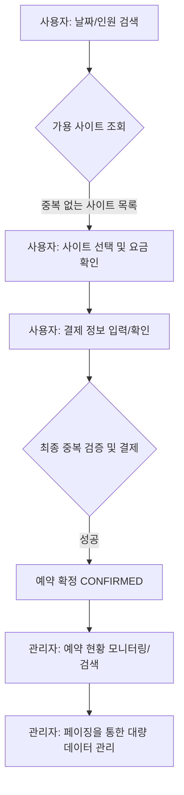

# Reservation 도메인 최종 통합 리포트 (Phase 2 완료)

**날짜**: 2026-03-17  
**작성자**: parkcoding (Git user.name)  
**작업 단계**: Phase 2 MVP 핵심 도메인 (Reservation) 기능 구현 및 페이징 고도화 완료

---

## 🗺️ 1. 전체 흐름 (Flow) 시각화

예약 도메인은 사용자의 검색부터 관리자의 최종 확인까지 유기적으로 연결되어 있습니다. 아래 흐름도는 데이터가 어떻게 흐르고 상태가 변하는지를 보여줍니다.



### [단계별 상세 설명]
| 단계 | 주요 행위 | 시스템 내부 동작 |
| :--- | :--- | :--- |
| **1. 검색** | 사용자가 원하는 일정(체크인/아웃) 입력 | DB에서 해당 날짜와 겹치는 기존 예약이 없는 사이트만 필터링 |
| **2. 선택** | 배치도 또는 목록에서 사이트 선택 | 클라이언트 JavaScript가 인원수/박수에 따른 요금을 실시간 계산 |
| **3. 검증** | 사용자가 '예약하기' 클릭 | 서버가 다시 한번 가격을 계산하고, 그 찰나의 중복 예약 여부를 최종 확인 |
| **4. 완료** | 예약 성공 페이지 이동 | **PRG 패턴**을 사용하여 새로고침 시 중복 예약 방지 |
| **5. 관리** | 관리자가 전체 내역 조회 | **Paging 기술**을 적용하여 수천 건의 데이터도 빠르고 끊김 없이 조회 |

---

## 💻 2. 핵심 코드 분석 (상세 주석 포함)

### A. 마법의 중복 체크 쿼리 (Repository)
가장 중요한 로직은 "내가 빌리려는 시간과 이미 빌려간 시간이 겹치지 않는가?"를 찾는 것입니다.

```java
// ReservationRepository.java
@Query("SELECT s FROM Site s JOIN FETCH s.zone z WHERE " +
        "(:zoneId IS NULL OR z.id = :zoneId) AND " + // 구역 필터링 (선택사항)
        "(:peopleCount IS NULL OR s.maxPeople >= :peopleCount) AND " + // 인원수 필터링
        "s.id NOT IN (" + // 아래 조건에 해당하는 사이트는 제외하고 가져옴
        "  SELECT r.site.id FROM Reservation r " +
        "  WHERE (r.checkIn < :checkOut AND r.checkOut > :checkIn) " + // 💡 핵심: 기간 중복 공식
        "  AND r.status IN :statuses" + // 예약 대기/확정 상태인 것만 체크
        ")")
List<Site> findAvailableSites(@Param("checkIn") LocalDate checkIn, 
                              @Param("checkOut") LocalDate checkOut, 
                              @Param("statuses") List<ReservationStatus> statuses,
                              @Param("zoneId") Long zoneId,
                              @Param("peopleCount") Integer peopleCount);
```

### B. 관리자용 페이징 및 검색 로직 (Service)
수만 건의 예약 내역을 한꺼번에 불러오면 서버가 멈출 수 있습니다. 이를 '페이지' 단위로 나누어 가져오는 핵심 로직입니다.

```java
// ReservationService.java
public AdminResponse.ReservationPageDTO findAllForAdmin(AdminRequest.ReservationSearchDTO searchDTO, Pageable pageable) {
    // 1. DB에서 검색 조건에 맞는 데이터를 '한 페이지 분량'만 가져옴 (예: 10개)
    Page<Reservation> page = reservationRepository.findAllAdminSearch(
            searchDTO.getKeyword(), 
            searchDTO.getCheckIn(), 
            searchDTO.getStatus(),
            pageable);

    // 2. DB에서 가져온 알맹이(Entity)를 화면에 보여줄 바구니(DTO)로 변환
    List<AdminResponse.ReservationListDTO> dtoList = page.getContent().stream()
            .map(r -> {
                // 숙박 일수 및 상태별 CSS 클래스 결정 (화면 디자인용)
                long nights = ChronoUnit.DAYS.between(r.getCheckIn(), r.getCheckOut());
                return AdminResponse.ReservationListDTO.builder()
                        .id(r.getId())
                        .username(r.getUser().getName())
                        .siteName(r.getSite().getSiteName())
                        .checkIn(r.getCheckIn())
                        .checkOut(r.getCheckOut())
                        .totalPrice(r.getTotalPrice())
                        .statusText(r.getStatus().getName()) // "확정됨", "취소요청" 등
                        .build();
            })
            .toList();

    // 3. 하단 페이징 버튼 정보 계산 (예: [1] [2] [3] [4] [5] 다음)
    int totalPages = page.getTotalPages(); // 전체가 몇 페이지인지
    int currentPage = page.getNumber(); // 지금 내가 보고 있는 페이지
    int startPage = Math.max(0, (currentPage / 5) * 5); // 시작 번호
    int endPage = Math.min(startPage + 4, totalPages - 1); // 끝 번호

    // 4. 최종적으로 데이터 목록과 페이징 정보를 합쳐서 반환
    return AdminResponse.ReservationPageDTO.builder()
            .reservations(dtoList)
            .pagination(pagination)
            .build();
}
```

---

## 🧸 3. 초등학생도 이해하는 쉬운 비유

### 1. 예약 중복 체크: "도서관 책 대출"
*   **상황**: 내가 3월 1일부터 3월 5일까지 '해리포터' 책을 빌리고 싶어요.
*   **조사**: 사서 선생님(서버)이 장부를 봐요. "음, 3월 4일에 철수가 이미 빌려가기로 했네? 그럼 너는 못 빌려."
*   **최종 확인**: 내가 빌리려고 사인하려는 찰나, 옆에 있던 영희가 스마트폰 앱으로 **0.1초 먼저** 대출 버튼을 눌렀어요! 사서 선생님은 사인하기 직전에 장부를 다시 보고 말해요. "미안! 방금 영희가 먼저 빌려갔어. 넌 안 돼." (이것이 서버의 최종 `exists` 검증입니다.)

### 2. 페이징 기술: "두꺼운 백과사전 읽기"
*   예약 내역이 10,000건이 넘는 것은 아주 두꺼운 백과사전과 같아요.
*   한꺼번에 다 읽으려고 하면 팔도 아프고 머리도 어질어질하죠(서버 과부하).
*   그래서 우리는 **'포스트잇'**을 붙여서 **'10쪽씩'** 나누어서 읽기로 했어요.
*   "사서 선생님, 5번째 페이지(Page 5)만 보여주세요!"라고 요청하면 선생님은 딱 그 부분만 펴서 보여주는 것이 바로 **페이징(Paging)** 기술입니다.

---

## 🧠 4. 어려운 기술/개념 해설

### 1. JPQL 기간 중복 체크 공식 (`A.start < B.end AND A.end > B.start`)
*   **의미**: 두 기간이 조금이라도 겹치는지 확인하는 '마법의 공식'입니다.
*   내 퇴실일이 남의 입실일보다 늦고, 내 입실일이 남의 퇴실일보다 빠르면 무조건 겹치게 되어 있습니다. 복잡한 `if-else` 문 없이 이 한 줄로 모든 겹침 상황(포함, 일부 겹침 등)을 잡아낼 수 있습니다.

### 2. PRG (Post-Redirect-Get) 패턴
*   **문제**: 예약 완료 버튼을 누르고 성공했는데, 신나서 '새로고침(F5)'을 마구 누르면 예약이 두 번, 세 번 계속 서버로 전송됩니다.
*   **해결**: 서버가 예약을 성공시킨 뒤 바로 "성공 페이지로 가!"라고 주소를 알려주고 브라우저를 이동시켜 버립니다(`Redirect`). 그러면 사용자가 새로고침을 눌러도 '성공했다는 결과 페이지'만 새로고침될 뿐, 예약 요청은 다시 가지 않습니다.

### 3. Pageable & Page 객체
*   **Pageable**: "몇 번째 페이지를, 몇 개씩, 어떤 순서로 가져올지" 적힌 **요청서**입니다.
*   **Page**: DB에서 가져온 **실제 데이터 10개**와 함께, "전체는 몇 개인지", "다음 페이지가 있는지" 같은 **통계 정보**가 담긴 종합 선물 세트입니다.
