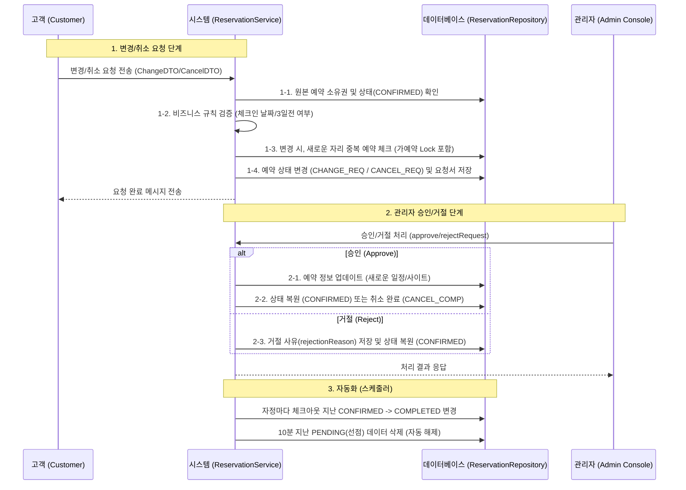

# Reservation 도메인 확장 기능 통합 보고서 (Phase 3)

**Reporter:** parkcoding
**Date:** 2026-03-23

---

## 🏕️ 이번 작업의 비유: '프리미엄 캠핑장 전담 컨시어지 서비스'

이번 Phase 3 작업은 단순한 예약 시스템을 넘어, **'캠핑장 전담 컨시어지(Concierge)'**를 고용한 것과 같습니다.

- **기존 시스템 (Phase 1~2)**: 고객이 빈 자리를 보고 직접 예약하고 돈을 내면 끝나는 단순한 '무인 자판기' 형태였습니다.
- **확장된 시스템 (Phase 3)**: 고객이 예약을 변경하고 싶거나 취소하고 싶을 때, 컨시어지(시스템)에게 **'요청'**을 합니다. 컨시어지는 이 요청이 타당한지(이용일이 지나지 않았는지), 다른 손님과 겹치지는 않는지 꼼꼼히 따져본 뒤 관리자에게 전달합니다. 관리자가 승인하면 컨시어지가 즉시 장부를 수정하고 손님에게 알려줍니다. 또한, 손님이 퇴실하면 컨시어지가 자동으로 체크아웃 처리를 하여 다음 손님을 맞이할 준비를 마칩니다.

---

## 📊 예약 변경/취소 통합 실행 흐름 (Sequence Diagram)



---

## 🛠️ 핵심 실행 코드 및 로직 설명 (Method-level)

### 1. 예약 변경 요청 (`requestChange`)
고객이 예약을 변경하고자 할 때 작동하는 첫 번째 핵심 로직입니다.

```java
@Transactional
public void requestChange(ReservationRequest.ChangeDTO dto, LoginDTO sessionUser) {
        // 1. 원본 예약 조회 및 소유권 검증 (남의 예약을 바꿀 수 없게 함)
        Reservation reservation = reservationRepository.findById(dto.getReservationId())
                        .orElseThrow(() -> new Exception404("예약을 찾을 수 없습니다."));

        if (!reservation.getUser().getId().equals(sessionUser.getId())) {
                throw new Exception403("본인의 예약만 변경 요청할 수 있습니다.");
        }

        // 2. 비즈니스 규칙 검증 (이미 이용 중이거나 과거 예약은 변경 불가)
        if (reservation.getStatus() != ReservationStatus.CONFIRMED) {
                throw new Exception400("확정된 예약만 변경 요청이 가능합니다.");
        }

        if (!reservation.getCheckIn().isAfter(LocalDate.now())) {
                throw new Exception400("이용일 당일 및 과거 예약은 온라인 변경이 불가능합니다.");
        }

        // 3. 중복 예약 최종 체크 (가예약 Lock 로직 포함)
        // 새로운 자리가 이미 누군가에 의해 선점되었거나 변경 요청 중인지 쿼리로 확인합니다.
        List<ReservationStatus> activeStatuses = List.of(
                        ReservationStatus.PENDING, ReservationStatus.CONFIRMED,
                        ReservationStatus.CHANGE_REQ, ReservationStatus.CANCEL_REQ);
        boolean isExist = reservationRepository.existsBySiteIdAndDateRange(
                        dto.getNewSiteId(), dto.getNewCheckIn(), dto.getNewCheckOut(), activeStatuses);

        if (isExist) {
                throw new Exception400("해당 기간은 이미 예약되었거나 변경 요청 중인 자리입니다.");
        }

        // 4. 원본 예약 상태 변경 (장부에 '변경 요청 중' 깃발을 꽂음)
        reservation.updateStatus(ReservationStatus.CHANGE_REQ);

        // 5. 변경 요청서(History) 생성 및 저장
        ReservationChangeRequest changeRequest = ReservationChangeRequest.builder()
                        .reservation(reservation)
                        .newCheckIn(dto.getNewCheckIn())
                        .newCheckOut(dto.getNewCheckOut())
                        .newSite(siteRepository.findById(dto.getNewSiteId()).get())
                        .newPeopleCount(dto.getNewPeopleCount())
                        .status(RequestStatus.PENDING) // 승인 대기 상태로 저장
                        .build();

        reservationChangeRequestRepository.save(changeRequest);
}
```

### 2. 고도화된 중복 예약 방지 쿼리 (`existsBySiteIdAndDateRange`)
단순한 예약을 넘어, **'승인 대기 중인 변경 요청'**까지 고려하여 중복을 원천 차단합니다.

```java
// ReservationRepository.java
@Query("SELECT (COUNT(r) > 0 OR COUNT(cr) > 0) FROM Site s " +
        // 이미 확정된 예약이나 취소/변경 요청 중인 원본 예약들 체크
        "LEFT JOIN Reservation r ON r.site.id = s.id AND r.status IN :statuses " +
        "AND (r.checkIn < :checkOut AND r.checkOut > :checkIn) " +
        // 다른 누군가가 이 자리로 옮기겠다고 관리자 승인을 기다리는 중인지(가예약 Lock) 체크
        "LEFT JOIN ReservationChangeRequest cr ON cr.newSite.id = s.id AND cr.status = 'PENDING' " +
        "AND (cr.newCheckIn < :checkOut AND cr.newCheckOut > :checkIn) " +
        "WHERE s.id = :siteId")
boolean existsBySiteIdAndDateRange(...);
```

### 3. 관리자 승인 처리 (`approveRequest`)
관리자가 승인 버튼을 누르는 순간, 실제 예약 정보가 갱신됩니다.

```java
@Transactional
public void approveRequest(Long id) {
        Reservation r = reservationRepository.findById(id).orElseThrow();

        if (r.getStatus() == ReservationStatus.CHANGE_REQ) {
                // 승인 대기 중인 변경 요청서를 찾아옴
                ReservationChangeRequest req = reservationChangeRequestRepository.findByReservationId(id)
                                .stream().filter(c -> c.getStatus() == RequestStatus.PENDING).findFirst().get();

                // 1. 원본 예약 엔티티의 정보를 요청서의 내용(날짜, 사이트, 인원)으로 덮어씀
                r.updateReservationInfo(
                                req.getNewCheckIn(), req.getNewCheckOut(),
                                req.getNewSite(), req.getNewPeopleCount(),
                                r.getVisitorName(), r.getVisitorPhone(), r.getTotalPrice());
                
                // 2. 요청서는 '승인됨' 처리, 원본 예약은 다시 '확정' 상태로 변경
                req.approve();
                r.updateStatus(ReservationStatus.CONFIRMED);
        }
        // (취소 승인 로직도 동일한 패턴으로 작동)
}
```

### 4. 예약 상태 자동 업데이트 스케줄러 (`autoUpdateReservationStatus`)
사람이 일일이 장부를 확인하지 않아도 시스템이 스스로 관리합니다.

```java
@Transactional
@Scheduled(cron = "0 0 0 * * *") // 매일 자정 00시 정각에 자동 실행
public void autoUpdateReservationStatus() {
        LocalDate today = LocalDate.now();
        
        // 체크아웃 날짜가 어제인 '확정' 예약들을 모두 찾아옴
        List<Reservation> expiredReservations = reservationRepository.findByStatusAndCheckOutBefore(
                ReservationStatus.CONFIRMED, today
        );

        // 한 번에 '이용 완료' 상태로 변경하여 관리의 편의성을 높임
        for (Reservation reservation : expiredReservations) {
            reservation.updateStatus(ReservationStatus.COMPLETED);
        }
}
```

---

## 💡 어려운 개념 및 기술 설명

### 1. 가예약 락 (Soft-Locking via PENDING/CHANGE_REQ)
- **개념**: 실제 결제가 완료되지 않았거나 관리자가 승인하기 전이라도, **'우선순위'**를 부여하여 다른 사람이 해당 기간을 가로채지 못하게 하는 기술입니다.
- **적용**: `findAvailableSites` 쿼리에서 현재 승인 대기 중인 `ReservationChangeRequest`의 목적지 사이트까지 검색 대상에서 제외함으로써, 데이터 충돌을 물리적인 DB 락 없이 비즈니스 로직으로 우아하게 해결했습니다.

### 2. JPA 양방향 연관관계와 Cascade (영속성 전이)
- **개념**: 부모(예약)가 바뀔 때 자식(요청 이력)도 함께 운명을 같이하게 하는 설정입니다.
- **적용**: `Reservation` 엔티티에 `changeRequests` 리스트를 `OneToMany`로 연결하고 `CascadeType.ALL`을 적용했습니다. 이를 통해 예약 정보를 불러올 때 과거의 모든 변경/취소 시도 이력을 한 번에 조회할 수 있게 되어, 관리자 상세 페이지 구현이 매우 효율적으로 이루어졌습니다.

### 3. 스프링 스케줄러 (@Scheduled)
- **개념**: 특정 시간에 맞춰 로직을 자동으로 실행하는 '알람 시계' 기능입니다.
- **적용**: `cron` 표현식을 사용하여 매일 자정 시스템이 잠자는 동안 자동으로 데이터를 청소하고 상태를 갱신하게 하여, 관리자의 업무 부담을 획기적으로 줄였습니다.

---

## 🚀 추가 제언 (Future Scope)

- **가격 재계산 로직**: 현재는 변경 승인 시 기존 가격을 유지하고 있습니다. 추후 사이트가 바뀌거나 인원이 늘어날 경우, 관리자가 승인 화면에서 추가 결제금액이나 환불금액을 확인하고 처리하는 인터페이스를 추가하면 완벽한 운영 시스템이 될 것입니다.
- **알림톡 연동**: 승인/거절 처리가 완료될 때 고객에게 SMS나 카카오 알림톡을 보내는 기능을 추가하면 사용자 경험(UX)이 더욱 개선될 것입니다.

---
**보고서 작성 완료.** 본 기능들은 통합 테스트를 통해 모든 비즈니스 규칙 준수를 검증받았습니다.
